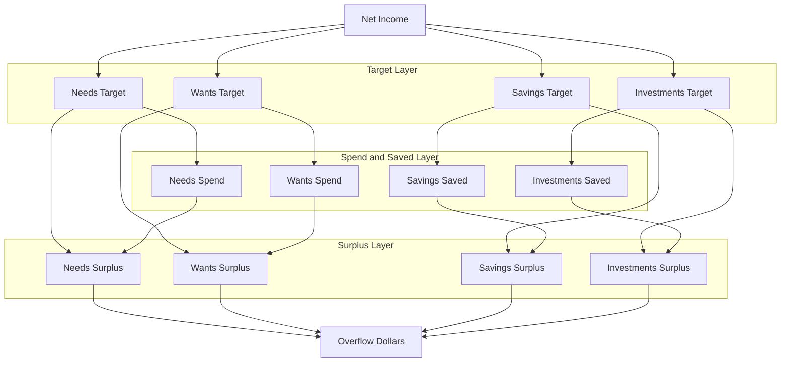
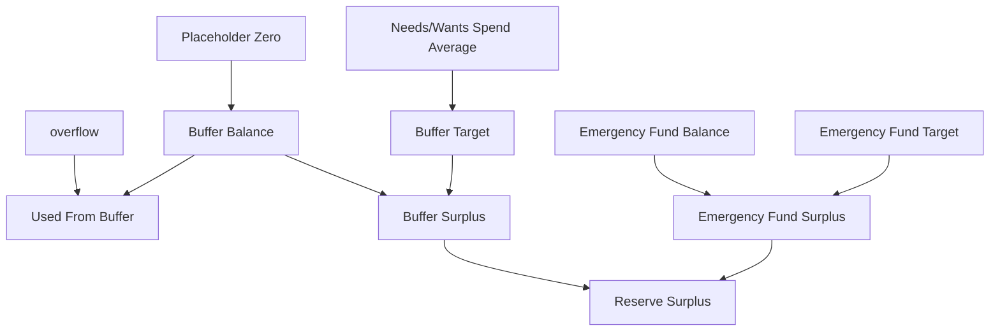
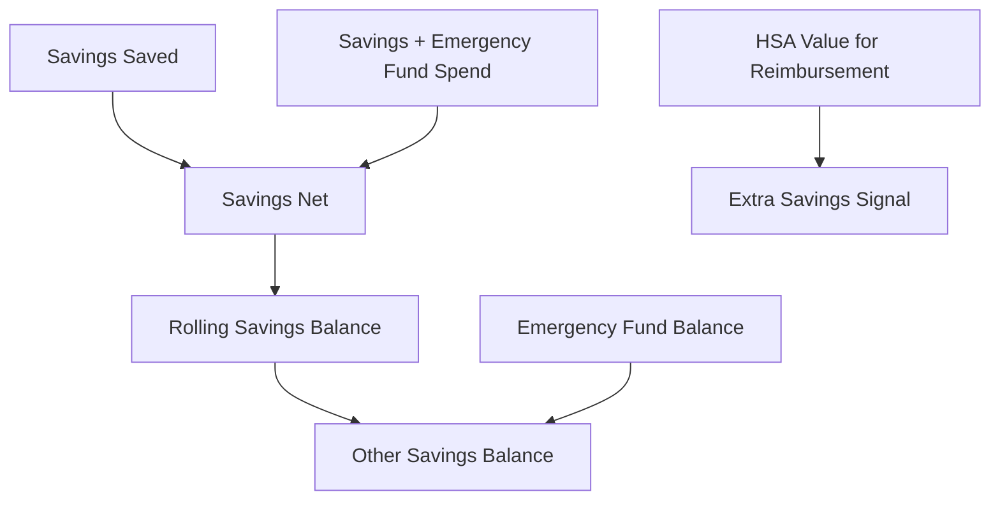

# Adherence Waterfall Flowchart

This shows how the current adherence waterfall sheet thinks about income, spending, savings, buffer cash, emergency fund cash, and HSA reimbursement value.

## 50/30/15/5 Plan



## Buffer And Reserves



## Savings Details



## Current Sheet Logic

| Sheet column | Meaning |
| --- | --- |
| `Net Income` | Income deposited to budget accounts for the period. |
| `Needs Target` | 50% of Net Income. |
| `Needs Spend` | Actual Needs spending, shown as a negative number. |
| `Needs Surplus` | Needs Target plus Needs Spend. Positive means under target; negative means over target. |
| `Wants Target` | 30% of Net Income. |
| `Wants Spend` | Actual Wants spending, shown as a negative number. |
| `Wants Surplus` | Wants Target plus Wants Spend. Positive means under target; negative means over target. |
| `Savings Target` | 5% of Net Income. |
| `Savings Saved` | Assignments to Savings and Emergency Fund categories, shown as a negative number to compare against the target. |
| `Savings Surplus` | Savings Target plus Savings Saved. Positive means under the target; negative means more than target was assigned. |
| `Savings Net` | Savings and Emergency Fund assignments minus spending from those categories. |
| `Rolling Savings Balance` | Month-end Savings plus Emergency Fund balance in YNAB. |
| `Investments Target` | 15% of Net Income. |
| `Investments Saved` | Assignments to taxable investment categories, shown as a negative number to compare against the target. |
| `Investments Surplus` | Investments Target plus Investments Saved. Positive means under target; negative means more than target was assigned. |
| `Overflow Dollars` | Net Income minus current Needs/Wants spend and saved dollars. |
| `Buffer Balance` | Temporarily set to zero while buffer balance logic is being reconsidered. |
| `Buffer Target` | Average Needs/Wants spend from the current year once six complete months exist; otherwise the trailing six complete months. |
| `Buffer Surplus` | Temporarily set to zero while buffer surplus logic is being reconsidered. |
| `Emergency Fund Target` | Buffer Target multiplied by 3. |
| `Emergency Fund Balance` | Cash emergency fund balance in YNAB. |
| `Emergency Fund Surplus` | Emergency Fund Balance minus Emergency Fund Target. HSA reimbursement value is not included. |
| `Reserve Surplus` | Buffer Surplus plus Emergency Fund Surplus. This is the combined cash reserve amount to drive toward zero. |
| `HSA Value for Reimbursement` | Running total of HSA-reimbursable spending that could be reimbursed later. This is extra savings, not emergency fund cash. |
| `Other Savings Balance` | Savings category balance outside the Emergency Fund cash balance. |
| `Used From Buffer` | Negative monthly overflow covered by current Needs/Wants available. |

## Formula Summary

```text
Needs Surplus = Needs Target + Needs Spend
Wants Surplus = Wants Target + Wants Spend
Savings Surplus = Savings Target + Savings Saved
Investments Surplus = Investments Target + Investments Saved

Overflow Dollars =
  Net Income
  - current Needs/Wants spending
  - saved dollars

Buffer Balance = 0 while buffer logic is being reconsidered
Buffer Surplus = 0 while buffer logic is being reconsidered
Emergency Fund Target = Buffer Target * 3
Emergency Fund Surplus = Emergency Fund Balance - Emergency Fund Target
Reserve Surplus = Buffer Surplus + Emergency Fund Surplus

HSA Value for Reimbursement is tracked separately from Reserve Surplus.
```
